# LGA1700 Water Block CFD Simulation

Conjugate heat transfer CFD analysis of LGA1700 CPU water block with jet impingement cooling and porous media fin array modeling.

**Geometry Source:** [EK-CPU Lignum on GrabCAD](https://grabcad.com/library/ek-cpu-lignum-1)

---

## Overview

CFD analysis demonstrating conjugate heat transfer modeling of a high-performance CPU liquid cooling block for LGA1700 socket. Features jet impingement cooling, porous media representation of microchannel fin arrays, and orthotropic thermal conductivity for directional heat transfer.

**Key Capabilities Demonstrated:**
- Conjugate heat transfer (CHT) between solid copper and liquid coolant
- Porous media modeling with directional thermal and flow resistance
- Realistic thermal interface resistance (TIM contact modeling)
- Energy balance validation and convergence monitoring

---

## Geometry Development

### Starting Point
The analysis began with a detailed CAD model of the EK-CPU Lignum water block from GrabCAD. The original geometry included full mechanical detail with mounting hardware, aesthetic features, and complex internal fin structures.

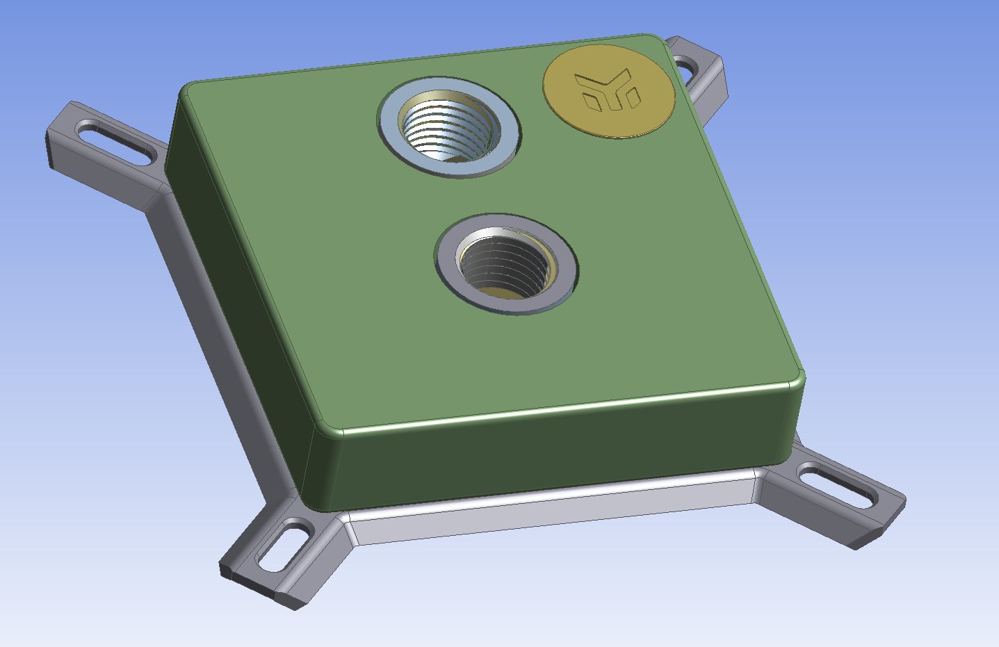
*Original imported geometry showing full mechanical assembly*

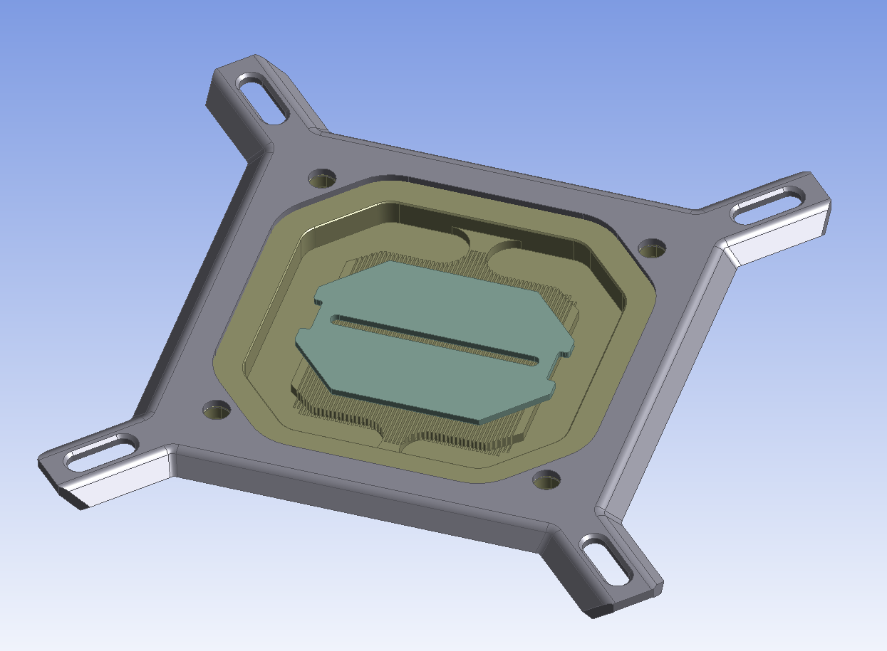
*Internal fin array structure from CAD model*

### CFD Simplification
The geometry was simplified for CFD analysis while preserving critical thermal-hydraulic features:

**Simplifications Made:**
- Removed mounting hardware and cosmetic features
- Extracted fluid domain from internal channels
- Simplified complex fin array geometry to porous media representation
- Created uniform CPU block representing IHS (Integrated Heat Spreader)
- Defined inlet/outlet boundaries for flow simulation

**Retained Critical Features:**
- Jet impingement plate geometry
- Overall flow path and channel dimensions
- CPU contact surface area and geometry
- Thermal mass distribution of copper cold plate

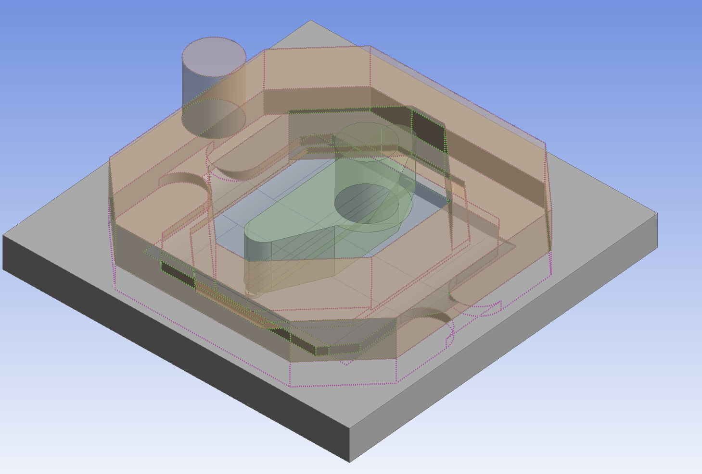
*Final CFD-ready geometry with fluid domain and simplified features*

### Key Dimensions
- **CPU Block (IHS representation):** 45mm × 38mm × 4mm (LGA1700 standard)
- **Fin Spacing:** 0.314 mm
- **Fin Thickness:** 0.371 mm
- **Calculated Porosity:** 0.458 (0.5 used for this simulation)

**Geometry available:** [`CFD_Geo_STP.stp`](geometry/CFD_Geo_STP.stp)

### Mesh Overview
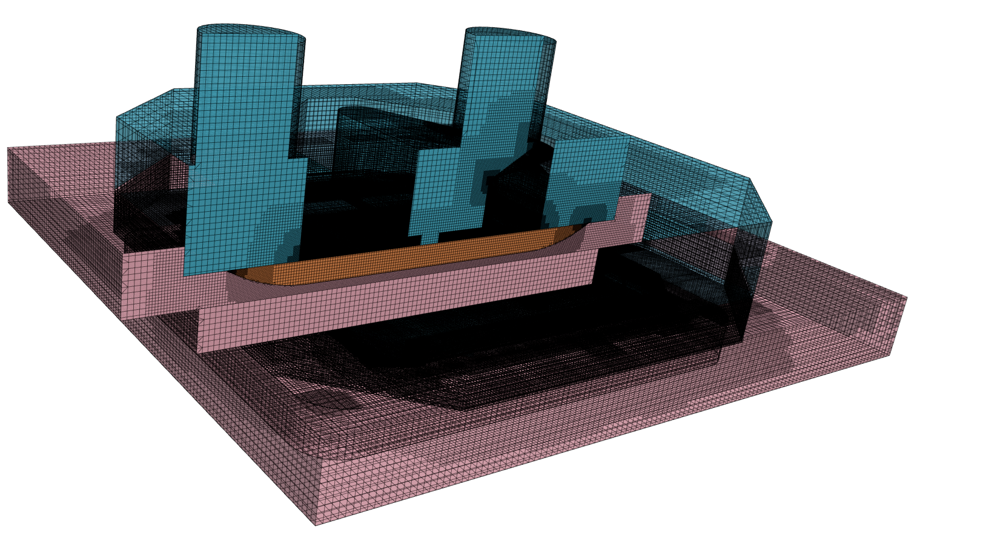
*Overall mesh structure with cut plane showing internal regions (outer shell transparent)*

### Mesh
- **CPU (IHS):** 54,368 cells
- **Cold Plate:** 1,698,419 cells
- **Fluid Inlet:** 1,003,017 cells
- **Porous Medium:** 4,335,825 cells
- **Fluid Outlet:** 642,756 cells
- **Total cell count:** 7,734,385 cells

### Region-Specific Meshing

#### CPU Block (IHS)
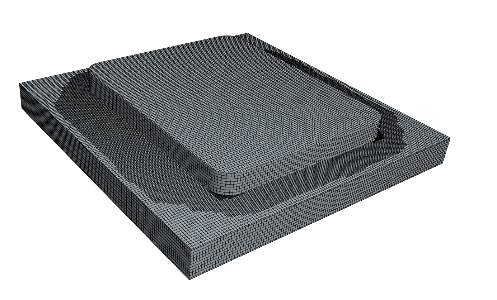
*Refined mesh on CPU block to capture thermal gradients*

**Details:**
- Uniform refinement throughout solid volume
- Fine resolution at IHS/cold plate interface for CHT coupling

#### Cold Plate Base
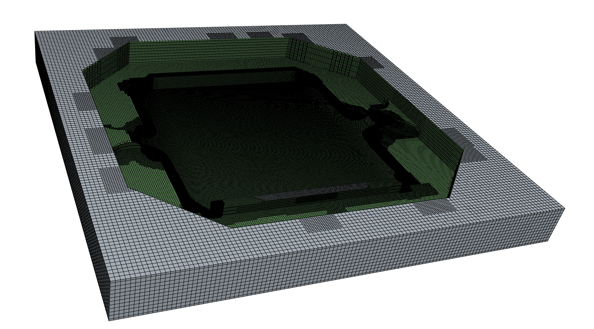
*Cold plate copper base mesh*

#### Porous Medium (Fin Array)
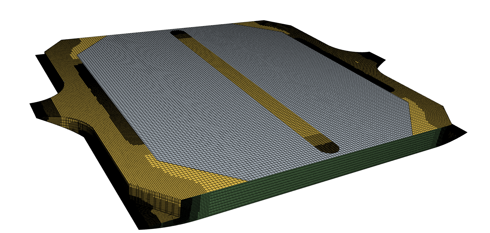
*Porous zone mesh representing microchannel fin array*

#### Fluid Domain
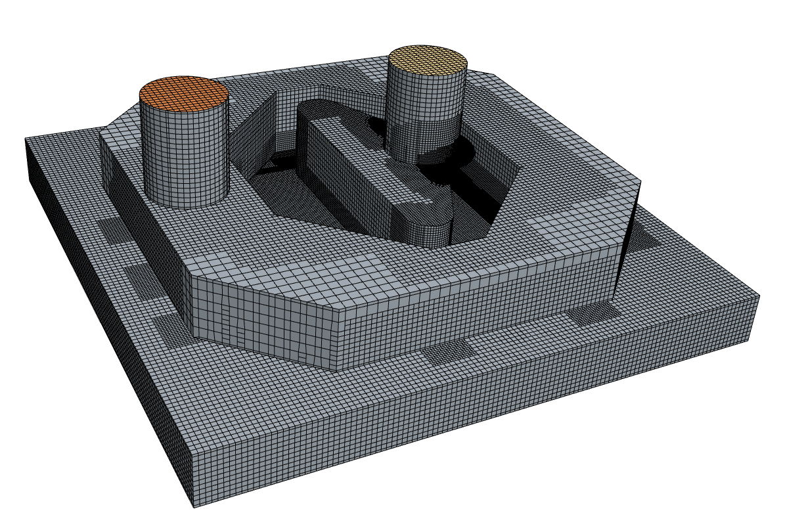
*Complete fluid domain mesh showing inlet/outlet regions*

---

## Physics Setup

### Solver Configuration
- **Solver Type:** Segregated Flow/Energy
- **Analysis Type:** Steady-state
- **Turbulence Model:** K-Omega SST
- **Heat Transfer:** Conjugate Heat Transfer (CHT) with solid-fluid coupling

### Material Properties

#### Solid Regions

**Cold Plate (Copper)**
- Density: 8,940 kg/m³
- Specific Heat: 386 J/kg·K
- Thermal Conductivity: 398 W/m·K

**CPU Block (Silicon)**
- Density: 2,329 kg/m³
- Specific Heat: 702 J/kg·K
- Thermal Conductivity: 124 W/m·K

#### Fluid Region

**Coolant (Liquid Water)**
- Temperature-dependent properties
- Reference temperature: 26.85°C

### Porous Media Configuration

The fin array is modeled as a porous medium with anisotropic properties to represent the directional nature of heat transfer and flow resistance through the microchannels.

#### Porous Medium Properties

| Property | XX Direction | YY Direction | ZZ Direction |
|----------|--------------|--------------|--------------|
| **Viscous Resistance** (kg/m³·s) | 100,000 | 100,000 | 1.0×10⁸ |
| **Inertial Resistance** (kg/m⁴) | 1.5 | 1.5 | 100 |
| **Thermal Conductivity** (W/m·K) | 217 | 217 | 1.0 |

**Porosity:** 0.5 (50% open volume for flow)

**Directional Behavior:**
- **XX, YY (Flow directions):** Low resistance, high effective thermal conductivity (copper-dominated parallel conduction)
- **ZZ (Blocked by fins):** High resistance, low thermal conductivity (water-limited serial conduction)

#### Derivation of Porous Parameters

**Porosity Calculation:**
```
ε = (fin spacing) / (fin spacing + fin thickness)
ε = 0.314 mm / (0.314 mm + 0.371 mm) = 0.458 → rounded to 0.5
```

**Viscous Resistance (Flow Directions):**
Based on Darcy flow through parallel plate channels:
```
1/α ≈ 12μ/h² 
where h = hydraulic diameter (fin spacing)
```

**Thermal Conductivity (Orthotropic):**
- **Flow directions (XX, YY):** Volume-weighted arithmetic mean (parallel conduction through copper fins)
  - k_eff = ε·k_water + (1-ε)·k_copper ≈ 217 W/m·K
- **Cross-flow direction (ZZ):** Harmonic mean (serial resistance through water gaps)
  - k_eff ≈ 1.0 W/m·K (water-limited)

### Thermal Interface Resistance

**CPU/Cold Plate Contact:**
- Interface resistance: 2.5×10⁻⁴ m²·K/W
- Represents high-quality thermal paste (e.g., Arctic MX-4, Noctua NT-H1)
- Applied at IHS/cold plate interface

---

---

## Boundary Conditions

### Inlet
- **Type:** Mass flow inlet
- **Mass flow rate:** 0.01 kg/s (10 g/s)
- **Temperature:** 26.85°C (300 K)
- **Turbulence:** 1% intensity, 1 mm length scale

### Outlet
- **Type:** Pressure outlet
- **Gauge pressure:** 0 Pa (atmospheric reference)
- **Backflow temperature:** 26.85°C

### CPU Heat Source
- **Type:** Volumetric heat generation
- **Power:** 250 W
- **Distribution:** Uniform across CPU block volume
- **Represents:** Intel Core i9-12900K at max turbo (PL2)

### Walls
- **External surfaces:** Adiabatic (no heat loss to ambient)
- **Internal interfaces:** Coupled (conjugate heat transfer)

### Operating Conditions
- **Reference pressure:** 101,325 Pa
- **Gravity:** Disabled (forced convection dominated)

---

---

## Results

### Temperature Distribution

#### Overall Thermal Field
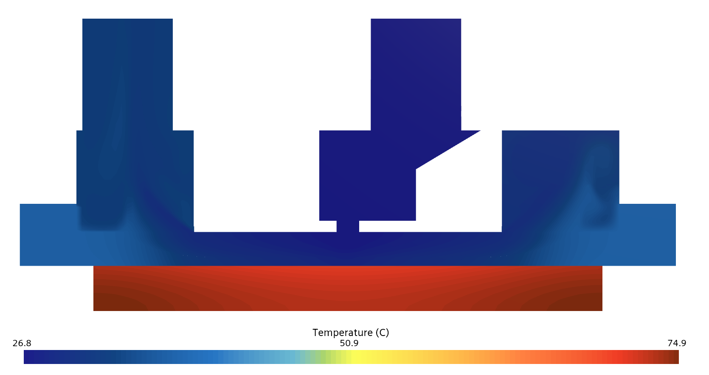
*Temperature distribution through centerplane (26.8°C to 74.9°C)*

#### Fluid Temperature Detail
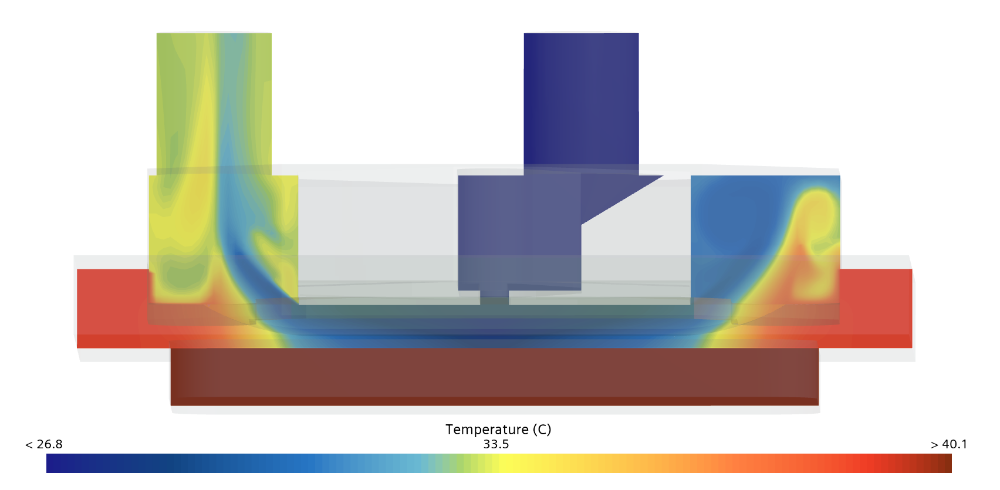
*Temperature distribution capped at 40.1°C to highlight fluid heating*

**Fluid Thermal Behavior:**
- Coolant enters at 26.85°C
- Progressive heating as flow moves radially outward from impingement zone
- Hottest fluid regions at fin array exit (approaching outlet)

#### Flow Path and Heating
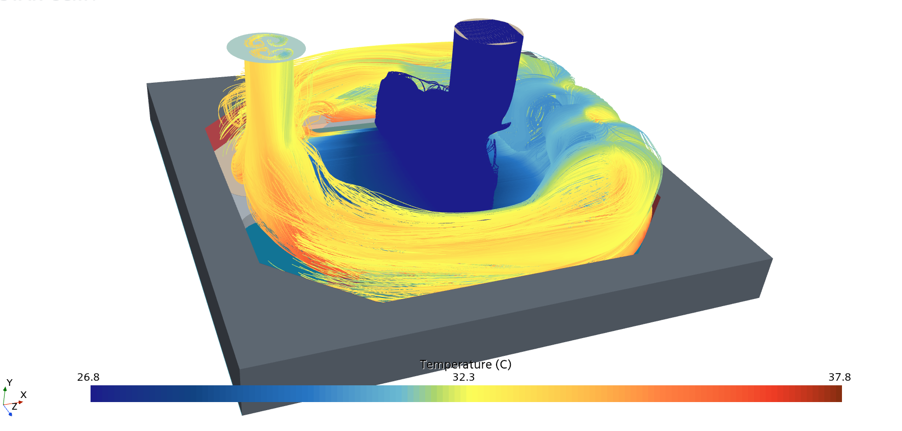
*Flow streamlines from inlet to outlet colored by temperature*

**Flow Characteristics:**
- Jet impingement creates radial flow pattern from center
- Coolant temperature increases along flow path through porous fin array
- Uniform flow distribution through microchannels
- Exit temperature varies by flow path length

### Quantitative Results

| Parameter | Value |
|-----------|-------|
| **CPU Peak Temperature** | 75.5°C |
| **CPU Average Temperature** | ~73.2°C |
| **Inlet Temperature** | 26.85°C |
| **Outlet Temperature** | ~32.9°C |
| **Temperature Rise (ΔT)** | ~6°C |
| **Heat Input** | 250 W |
| **Heat Removed** | ~249 W |
| **Energy Balance** | 99.6% |

---

## Validation

### Energy Balance

**Heat Input:**
- CPU volumetric heat generation: 250 W

**Heat Removed (from CFD):**
```
Q = ṁ × Cp × (T_out - T_in)
Q = 0.01 kg/s × 4186 J/kg·K × (32.9 - 26.85)°C
Q = 0.01 × 4186 × 6.05
Q = 253.3 W
```

**Energy closure: 253.3/250 = 101.3%**

*Note: Slight over-prediction (~1.3%) is within acceptable numerical accuracy for steady-state CFD.*

### Theoretical Comparison

**Predicted outlet temperature (from first law of thermodynamics):**
```
ΔT = Q / (ṁ × Cp) = 250 W / (0.01 kg/s × 4186 J/kg·K) = 5.97°C
T_out_theory = 26.85 + 5.97 = 32.82°C
```

**CFD result:** 32.9°C

**Difference:** 0.08°C (0.24%) **Excellent agreement**

### Thermal Resistance Assessment

**Case-to-coolant thermal resistance:**
```
R_case-coolant = (T_CPU_avg - T_fluid_in) / Q
R = (73.2°C - 26.85°C) / 250W = 0.185 K/W
```

**Peak thermal resistance:**
```
R_peak = (75.5°C - 26.85°C) / 250W = 0.195 K/W
```

**Typical high-performance CPU water blocks:** 0.10-0.20 K/W (case to coolant)

**Assessment:** Simulated thermal resistance of 0.185-0.195 K/W falls within the expected range for a quality water block with thermal paste interface (2.5E-4 m²·K/W contact resistance). Results are consistent with real-world performance of premium liquid cooling solutions.
