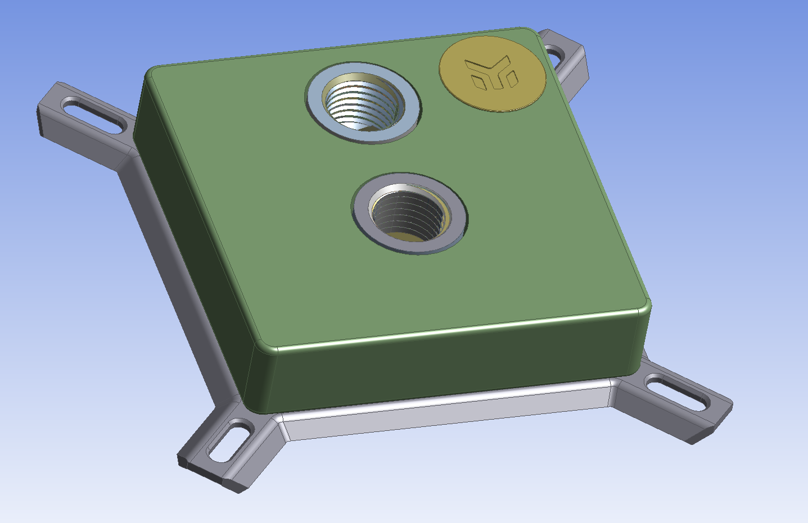
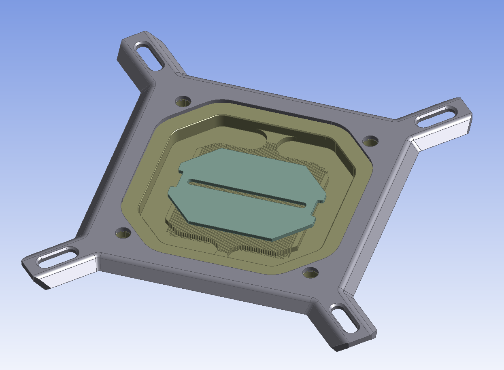
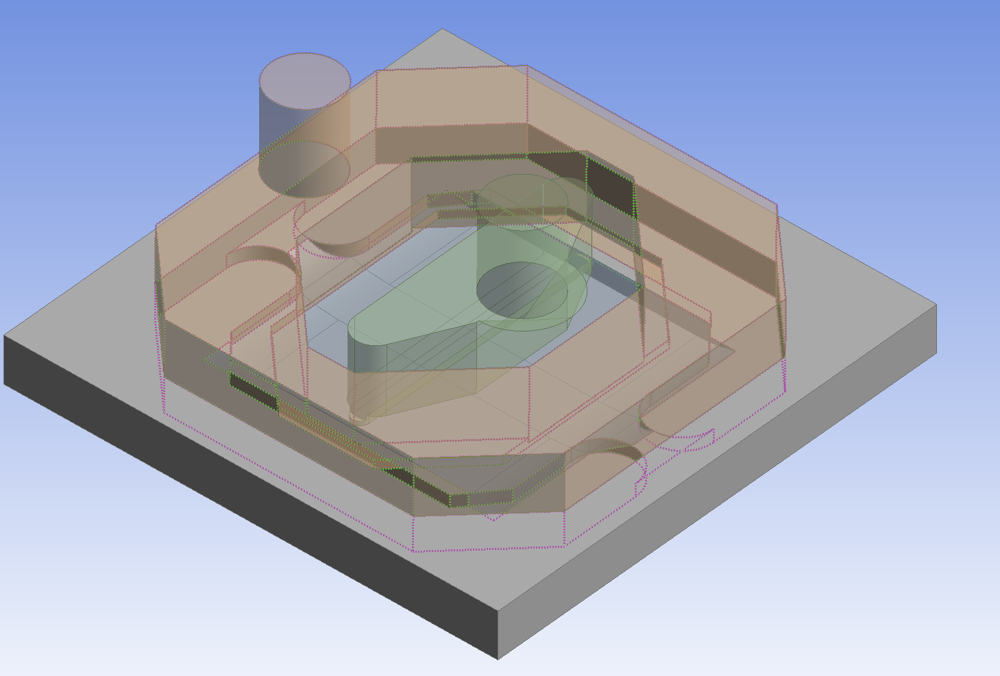
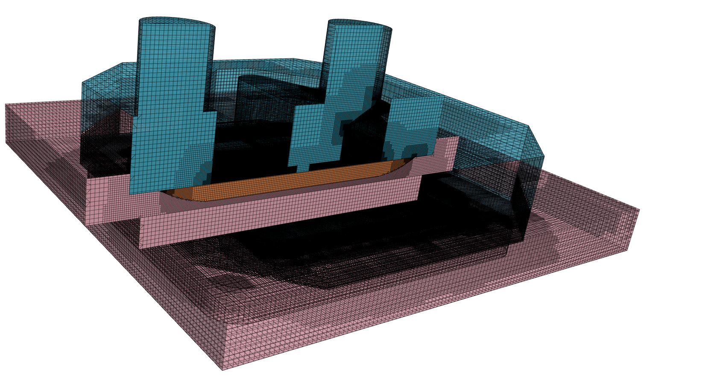
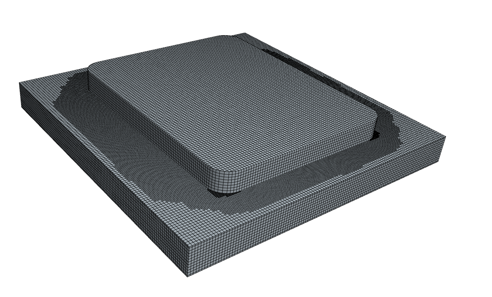
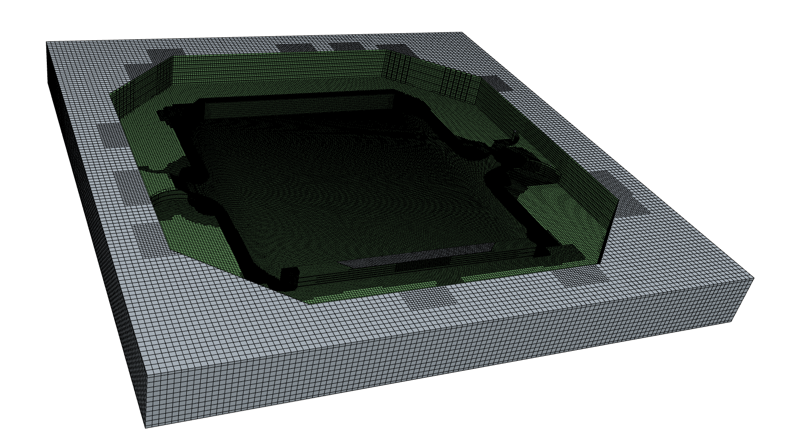
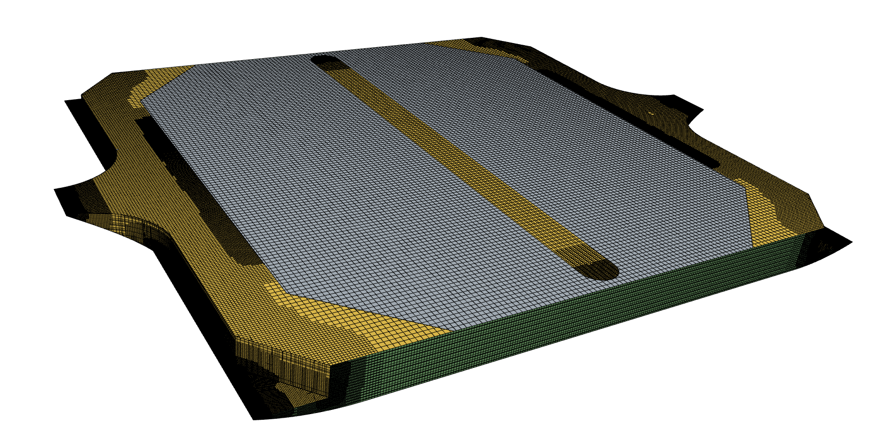
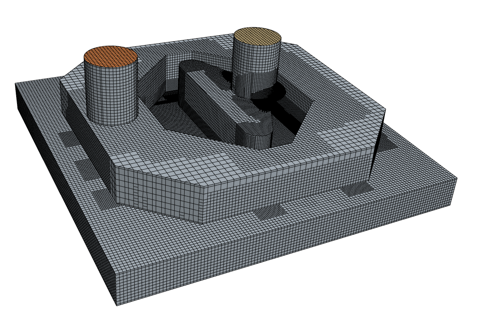

# LGA1700 Water Block CFD Simulation

Conjugate heat transfer CFD analysis of LGA1700 CPU water block with jet impingement cooling and porous media fin array modeling.

**Geometry Source:** [EK-CPU Lignum on GrabCAD](https://grabcad.com/library/ek-cpu-lignum-1)

---

## Overview

Advanced CFD analysis demonstrating conjugate heat transfer modeling of a high-performance CPU liquid cooling block for LGA1700 socket. Features jet impingement cooling, porous media representation of microchannel fin arrays, and orthotropic thermal conductivity for directional heat transfer.

**Key Capabilities Demonstrated:**
- Conjugate heat transfer (CHT) between solid copper and liquid coolant
- Porous media modeling with directional thermal and flow resistance
- Realistic thermal interface resistance (TIM contact modeling)
- Energy balance validation and convergence monitoring

---

## Geometry Development

### Starting Point
The analysis began with a detailed CAD model of the EK-CPU Lignum water block from GrabCAD. The original geometry included full mechanical detail with mounting hardware, aesthetic features, and complex internal fin structures.


*Original imported geometry showing full mechanical assembly*


*Internal fin array structure from CAD model*

### CFD Simplification
The geometry was simplified for CFD analysis while preserving critical thermal-hydraulic features:

**Simplifications Made:**
- Removed mounting hardware and cosmetic features
- Extracted fluid domain from internal channels
- Simplified complex fin array geometry to porous media representation
- Created uniform CPU block representing IHS (Integrated Heat Spreader)
- Defined inlet/outlet boundaries for flow simulation

**Retained Critical Features:**
- Jet impingement plate geometry
- Overall flow path and channel dimensions
- CPU contact surface area and geometry
- Thermal mass distribution of copper cold plate


*Final CFD-ready geometry with fluid domain and simplified features*

### Key Dimensions
- **CPU Block (IHS representation):** 45mm × 38mm × 4mm (LGA1700 standard)
- **Fin Spacing:** 0.314 mm
- **Fin Thickness:** 0.371 mm
- **Calculated Porosity:** 0.458 (45.8% open volume)
- **Contact Area:** ~1900 mm²

**Geometry available:** [`CFD_Geo_STP.stp`](geometry/CFD_Geo_STP.stp)

### Mesh Overview

*Overall mesh structure with cut plane showing internal regions (outer shell transparent)*

### Mesh
- **CPU (IHS):** 54,368 cells
- **Cold Plate:** 1,698,419 cells
- **Fluid Inlet:** 1,003,017 cells
- **Porous Medium:** 4,335,825 cells
- **Fluid Outlet:** 642,756 cells
- **Total cell count:** 7,734,385 cells
- **Prism layers:** 5 layers on all solid walls
- **y+ target:** < 5 for accurate wall heat transfer

### Region-Specific Meshing

#### CPU Block (IHS)

*Refined mesh on CPU block to capture thermal gradients*

**Details:**
- Uniform refinement throughout solid volume
- Fine resolution at IHS/cold plate interface for CHT coupling
- Cell size: [your value] mm

#### Cold Plate Base

*Cold plate copper base mesh showing prism layers*

#### Porous Medium (Fin Array)

*Porous zone mesh representing microchannel fin array*

**Details:**
- Coarser mesh appropriate for volume-averaged porous model
- 3-5 cells across porous region thickness
- No boundary layer mesh within porous zone (not needed for volume-averaged approach)

#### Fluid Domain

*Complete fluid domain mesh showing inlet/outlet regions*

---

## Physics Setup

### Solver Configuration
- **Solver Type:** Segregated Flow/Energy
- **Analysis Type:** Steady-state
- **Turbulence Model:** K-Omega SST
- **Heat Transfer:** Conjugate Heat Transfer (CHT) with solid-fluid coupling

### Material Properties

#### Solid Regions

**Cold Plate (Copper)**
- Density: 8,940 kg/m³
- Specific Heat: 386 J/kg·K
- Thermal Conductivity: 398 W/m·K

**CPU Block (Silicon)**
- Density: 2,329 kg/m³
- Specific Heat: 702 J/kg·K
- Thermal Conductivity: 124 W/m·K

#### Fluid Region

**Coolant (Liquid Water)**
- Temperature-dependent properties
- Reference temperature: 26.85°C

### Porous Media Configuration

The fin array is modeled as a porous medium with anisotropic properties to represent the directional nature of heat transfer and flow resistance through the microchannels.

#### Porous Medium Properties

| Property | XX Direction | YY Direction | ZZ Direction |
|----------|--------------|--------------|--------------|
| **Viscous Resistance** (kg/m³·s) | 100,000 | 100,000 | 1.0×10⁸ |
| **Inertial Resistance** (kg/m⁴) | 1.5 | 1.5 | 100 |
| **Thermal Conductivity** (W/m·K) | 217 | 217 | 1.0 |

**Porosity:** 0.5 (50% open volume for flow)

**Directional Behavior:**
- **XX, YY (Flow directions):** Low resistance, high effective thermal conductivity (copper-dominated parallel conduction)
- **ZZ (Blocked by fins):** High resistance, low thermal conductivity (water-limited serial conduction)

#### Derivation of Porous Parameters

**Porosity Calculation:**
```
ε = (fin spacing) / (fin spacing + fin thickness)
ε = 0.314 mm / (0.314 mm + 0.371 mm) = 0.458 → rounded to 0.5
```

**Viscous Resistance (Flow Directions):**
Based on Darcy flow through parallel plate channels:
```
1/α ≈ 12μ/h² 
where h = hydraulic diameter (fin spacing)
```

**Thermal Conductivity (Orthotropic):**
- **Flow directions (XX, YY):** Volume-weighted arithmetic mean (parallel conduction through copper fins)
  - k_eff = ε·k_water + (1-ε)·k_copper ≈ 217 W/m·K
- **Cross-flow direction (ZZ):** Harmonic mean (serial resistance through water gaps)
  - k_eff ≈ 1.0 W/m·K (water-limited)

### Thermal Interface Resistance

**CPU/Cold Plate Contact:**
- Interface resistance: 2.5×10⁻⁴ m²·K/W
- Represents high-quality thermal paste (e.g., Arctic MX-4, Noctua NT-H1)
- Applied at IHS/cold plate interface

---

## [Next Section: Boundary Conditions]
